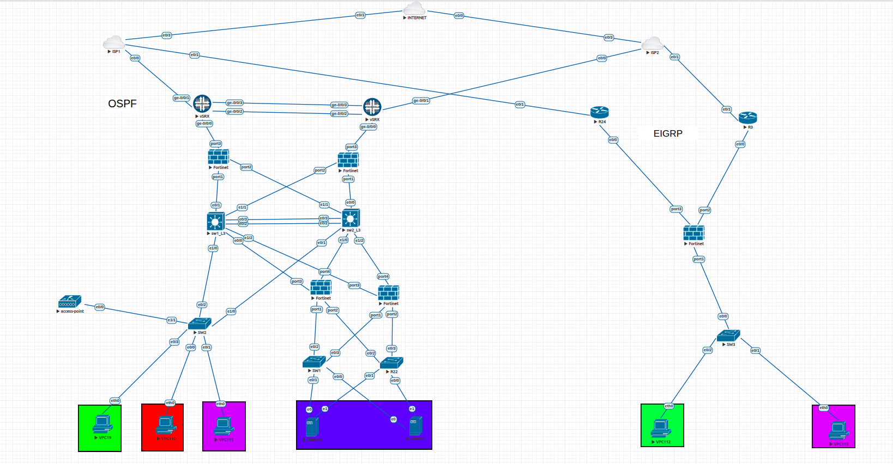

# Multi-Vendor Enterprise Network Infrastructure Lab (EVE-NG)

Welcome to my advanced, multi-vendor network simulation project. This lab is designed to bridge theoretical concepts from my CCNP Enterprise (ENARSI) studies into a practical, live enterprise environment, simulating real-world interoperability across Cisco, Juniper, and Fortinet platforms.

## 📐 Network Topology

---

## 🛠️ Implemented Features & HQ LAN Infrastructure (Phase 1)

### 1. Segmentation & Layer 2 Core
* **VLAN Design:** Successfully implemented enterprise-grade network segmentation, creating dedicated VLANs for core headquarters operations: `HR`, `IT`, `Sales`, `Management`, and `Guest/Employees WiFi`.
* **STP Optimization:** Fine-tuned Spanning Tree Protocol (STP) parameters (including Root Bridge selection and priority tuning) to guarantee an optimized, loop-free topology across the local infrastructure.

### 2. High Availability & L3 Redundancy
* **Link Aggregation:** Configured EtherChannel bundles between core switches to optimize local bandwidth capacity and provide hardware-level link redundancy.
* **Gateway Resiliency:** Implemented VRRP for Layer 3 gateway redundancy. 
* *Note: Overcame specific EVE-NG multi-vendor image sync limitations by migrating to Plain Text Authentication to ensure stable operations.*

---

## 🚀 Future Roadmap (Phase 2 - Next Steps)
* **Dynamic Routing Architecture:** Engineering and validating robust, scalable dynamic routing domains utilizing **OSPF** and **EIGRP** to handle enterprise traffic distribution and fast convergence.
* **Enterprise Security & Perimeter:** Deploying a FortiGate VM firewall to enforce strict security policies, access controls (ACLs), and zone-based traffic inspection.
* **Demilitarized Zone (DMZ):** Isolating public-facing network services and integrating the secure production servers' VLAN.

---

## 👤 About Me
* **Background:** Recently completed military service as a Network & IT Administrator in the IDF's Unit 8200.
* **Certifications:** Cisco CCNA Certified | CCNP Enterprise (ENARSI) Candidate.
* **Goal:** Actively looking for a Network Engineer or Integration Engineer position. 
* **Contact:** avielbichawork@gmail.com
